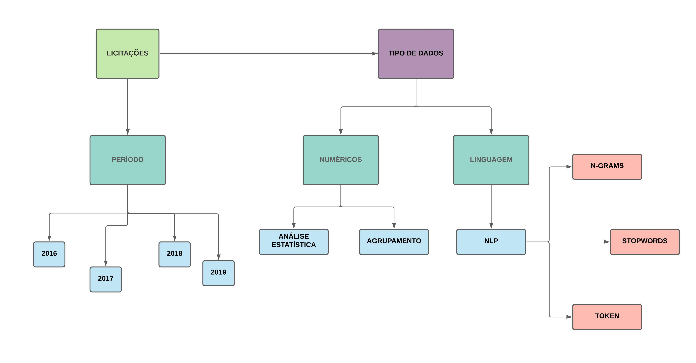

#  _*Caso de Estudo-Licitações_ 

##  _*Contextualização_ 
 O presente caso de estudo buscou avaliar padrões em comprar realizadas pelos estado do Rio Grande do Sul durante 4 anos: 2126, 2017, 2018 e 2019. Para isso, foram utilizados dados públicos oriundos do sistema LicitaCon do. TCE

##  _*Como o estudo foi realizado?_ 
 O trabalho foi realizado utilizando linguagem Python e IDE Jupyter Notebook. Há dois casos de aplicação de solucções propostas. O primeiro através de agrupamento e limpeza de dados numéricos, e o segundo através da aplicação de Natural Language Processing (NLP) TCE. O estudo decorreu de acordo com o fluxograma metodológico exposto na Figura abaixo: 

 

A justificative metodológica foi embasada na utilização de bibliotecas amplamente aplicáveis a estudos oriunddos da Linguagem Python. Dessa formaas bibliotecas NumPy (Harris et al., 2020), Pandas (McKinney, 2010) e Scikit-Learn (Pedregosa et al., 2011a) foram importadas para as etapas de pré-processamento e análise exploratória.

##  _*Quais respostas foram encontradas?_ 
 O estudo obteve a identificaçao de padrões em suma via duas alternativas: numérica e NLP

##  Referências 
Harris, C.R., Millman, K.J., van der Walt, S.J., Gommers, R., Virtanen, P., Cournapeau, D., Wieser, E., Taylor, J., Berg, S., Smith, N.J., Kern, R., Picus, M., Hoyer, S., van Kerkwijk, M.H., Brett, M., Haldane, A., del R’\io, J.F., Wiebe, M., Peterson, P., G’erard-Marchant, P., Sheppard, K., Reddy, T., Weckesser, W., Abbasi, H., Gohlke, C., Oliphant, T.E., 2020. Array programming with {NumPy}. Nature 585, 357–362. https://doi.org/10.1038/s41586-020-2649-2

Loper, E., Bird, S., 2002. NLTK: The Natural Language Toolkit.

Nadkarni, P.M., Ohno-Machado, L., Chapman, W.W., 2011. Natural language processing: An introduction. Journal of the American Medical Informatics Association. https://doi.org/10.1136/amiajnl-2011-000464

Pedregosa, F., Varoquaux, G., Gramfort, A., Michel, V., Thirion, B., Grisel, O., Blondel, M., Prettenhofer, P., Weiss, R., Dubourg, V., Vanderplas, J., Passos, A., Cournapeau, D., Brucher, M., Perrot, M., Duchesnay, E., 2011a. Scikit-learn: Machine Learning in {P}ython. Journal of Machine Learning Research 12, 2825–2830.

McKinney, W., 2010. Data Structures for Statistical Computing in Python, in: van der Walt, S., Millman, J. (Eds.), Proceedings of the 9th Python in Science Conference. pp. 56–61. https://doi.org/10.25080/Majora-92bf1922-00a
